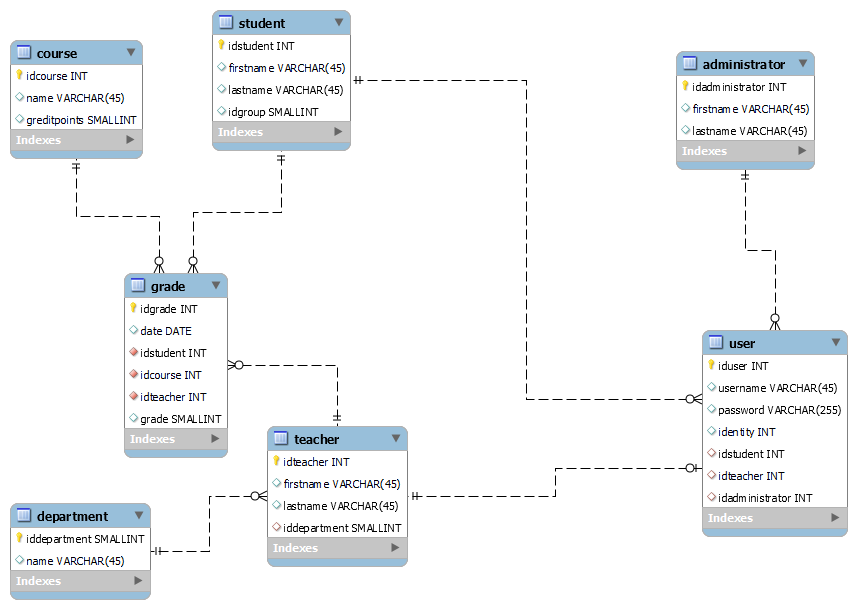

# university

This is an example about **.NET 6.0 WebApi**. The application is made based on **MVC-model**. There is one Controller which is named StudentController and a model which is named Student.

The data is hard coded to the model, in order to make the application simple.

## ER model

<a href="https://docs.github.com/en/get-started/writing-on-github/getting-started-with-writing-and-formatting-on-github/basic-writing-and-formatting-syntax">instructions for writing README file</a>
